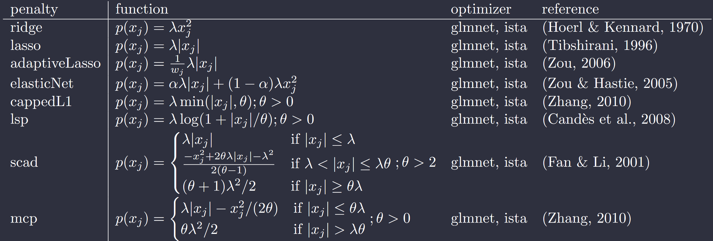

# Getting Started

**lessOptimizers** was initially a sub-folder of the **lessSEM** package. Therefore,
the default is currently to still assume that you are using the library in an R package.
In the [common_headers.h](https://github.com/jhorzek/lessOptimizers/blob/f8aa3169da617ca2d6afbd330e1fb5395ba40898/include/common_headers.h#L8)-file, 
you will find a variable called `USE_R`. If this variable is set to 1 (default), **lessOptimizers**
is setup to be used from R. If `USE_R` is set to zero, the library no longer relies on the R packages
**Rcpp** (Eddelbuettel et al., 2011) or **RcppArmadillo** (Eddelbuettel et al., 2014). The library can now be used in 
C++ projects as long as the [**armadillo**](https://arma.sourceforge.net/) (Sanderson et al., 2016)
library is installed. These settings are implemented in the [CMakeLists.txt](https://github.com/jhorzek/lessOptimizers/blob/main/CMakeLists.txt)-file included
in the project.

## Interfacing to **lessOptimizers**

As outlined in the introduction, the optimizers in **lessOptimizers** minimize functions
of the form 
$$g(\pmb\theta) = f(\pmb\theta) + p(\pmb\theta)$$
where $f(\pmb\theta)$ is (twice) continously differentiable with respect to $\theta$ and $p(\pmb\theta)$
is a non-differentiable penalty function (e.g., lasso or scad).
To use **lessOptimizers** for your project, you will need two functions.
First, a function that computes $f(\pmb\theta)$, the value of your un-
regularized objective function. Second, a function that computes 
$\triangledown_{\pmb\theta} f(\pmb\theta)$, the gradient vector of your
un-regularized objective function with respect to the parameters $\pmb\theta$.
We also assume that these functions use **armadillo**. If you don't use **armadillo**,
you may have to write a translation layer. The optimizer interface outlined in the following
is adapted from the [**ensmallen**](https://ensmallen.org/) library (Curtin et al.; 2021).

### Step 1: Including the necessary headers

First, let's include the necessary headers:

=== "R"

    ```
    #include <RcppArmadillo>
    // [[Rcpp :: depends ( RcppArmadillo )]]
    ```

=== "C++"

    ```
    #include <armadillo>
    ```

### Step 2: Implement the fit and gradient functions:

Let's assume that you want to estimate a linear regression model. In this case,
the fit and gradient function could look as follows:

```
double sumSquaredError(
    arma::colvec b, // the parameter vector
    arma::colvec y, // the dependent variable
    arma::mat X     // the design matrix
)
{
  // compute the sum of squared errors:
  arma::mat sse = arma::trans(y - X * b) * (y - X * b);

  // other packages, such as glmnet, scale the sse with
  // 1/(2*N), where N is the sample size. We will do that here as well

  sse *= 1.0 / (2.0 * y.n_elem);

  // note: We must return a double, but the sse is a matrix
  // To get a double, just return the single value that is in
  // this matrix:
  return (sse(0, 0));
}

arma::rowvec sumSquaredErrorGradients(
    arma::colvec b, // the parameter vector
    arma::colvec y, // the dependent variable
    arma::mat X     // the design matrix
)
{
  // note: we want to return our gradients as row-vector; therefore,
  // we have to transpose the resulting column-vector:
  arma::rowvec gradients = arma::trans(-2.0 * X.t() * y + 2.0 * X.t() * X * b);

  // other packages, such as glmnet, scale the sse with
  // 1/(2*N), where N is the sample size. We will do that here as well

  gradients *= (.5 / y.n_rows);

  return (gradients);
 }

```

With these two functions, we are ready to go. If you want to use the glmnet optimizer,
you may want to also implement a function that computes the Hessian. It can be beneficial to
provide a good starting point for the bfgs updates using this Hessian.


### Step 3: Creating a model object

**lessOptimizers** assumes that you pass a model-object to the optimizers. This model 
object ist implemented in the [`lessSEM::model`-class](https://github.com/jhorzek/lessOptimizers/blob/main/include/model.h).
Therefore, we have to create a custom class that inherits from `lessSEM::model` and 
implements our linear regression using the functions defined above:

```
#include "include/lessOptimizers/lessOptimizers.h"

// IMPORTANT: The library is calles lessOptimizers, but
// because it was initially a sub-folder of lessSEM, the
// namespace is still called lessSEM.

class linearRegressionModel : public lessSEM::model
{

public:
  // the lessSEM::model class has two methods: "fit" and "gradients".
  // Both of these methods must follow a fairly strict framework.
  // First: They must receive exactly two arguments:
  //        1) an arma::rowvec with current parameter values
  //        2) an Rcpp::StringVector with current parameter labels
  //          (NOTE: the lessSEM package currently does not make use of these
  //          labels. This is just for future use. If you don't want to use 
  //          the labels, just pass any lessSEM::stringVector you want).
  //          if you are using R, a lessSEM::stringVector is just an 
  //	      Rcpp::StringVector. Otherwise it is a custom vector. that can
  //	      be created with lessSEM::stringVector myVector(numberofParameters).
  // Second:
  //        1) fit must return a double (e.g., the -2-log-likelihood)
  //        2) gradients must return an arma::rowvec with the gradients. It is
  //           important that the gradients are returned in the same order as the
  //           parameters (i.e., don't shuffle your gradients, lessSEM will 
  //           assume that the first value in gradients corresponds to the
  //           derivative with respect to the first parameter passed to 
  //           the function).

  double fit(arma::rowvec b, lessSEM::stringVector labels) override
  {
    // NOTE: In sumSquaredError we assumed that b was a column-vector. We
    //  have to transpose b to make things work
    return (sumSquaredError(b.t(), y, X));
  }

  arma::rowvec gradients(arma::rowvec b, lessSEM::stringVector labels) override
  {
    // NOTE: In sumSquaredErrorGradients we assumed that b was a column-vector. We
    //  have to transpose b to make things work
    return (sumSquaredErrorGradients(b.t(), y, X));
  }

  // IMPORTANT: Note that we used some arguments above which we did not pass to
  // the functions: y, and X. Without these arguments, we cannot use our
  // sumSquaredError and sumSquaredErrorGradients function! To make these 
  // accessible to our functions, we have to define them:

  const arma::colvec y;
  const arma::mat X;

  // finally, we create a constructor for our class
  linearRegressionModel(arma::colvec y_, arma::mat X_) : y(y_), X(X_){};
};

```

Instances of `linearRegressionModel` can be passed to the `glmnet` or `ista` optimizers.

### Step 4: Interfacing to the optimizers

Ther are two interfaces you can use: 

1. A specialized interface, where the model is penalized only using one specific penalty function.
This requires more work, but is typically a bit faster than using the second approach.
2. A simplified interface that allows you to use any of the penalty functions (and also mix them)

We will use the simplified interface in the following. To this end, we will first create a new
instance of our linearRegressionModel:

```
arma::mat X = {{1.00, -0.70, -0.86},
               {1.00, -1.20, -2.10},
               {1.00, -0.15,  1.13},
               {1.00, -0.50, -1.50},
               {1.00,  0.83,  0.44},
               {1.00, -1.52, -0.72},
               {1.00,  1.40, -1.30},
               {1.00, -0.60, -0.59},
               {1.00, -1.10,  2.00},
               {1.00, -0.96, -0.20}};

arma::colvec y = {{ 0.56},
                  {-0.32},
                  { 0.01},
                  {-0.09},
                  { 0.18},
                  {-0.11},
                  { 0.62},
                  { 0.72},
                  { 0.52},
                  { 0.12}};

linearRegressionModel linReg(y, X);
```

Next, we create a vector with starting values using **armadillo**. This vector must be of 
length of the number of parameters in the model. In our case, these are three: the intercept
and two predictors.

```
arma::rowvec startingValues(3);
startingValues.fill(0.0);
```
**lessOptimizers** also expects labels for these parameters. The labels are stored in an object of
class `lessSEM::stringVector`:

=== "R"

    When using R, `lessSEM::stringVector` is identical to `Rcpp::StringVector`.
    ``` r
    Rcpp::StringVector parameterLabels;
    parameterLabels[0] = "b0";
    parameterLabels[1] = "b1";
    parameterLabels[2] = "b2";
    ```

=== "C++"

    ``` c++
    std::vector<std::string> labels {"b0", "b1", "b2"};
    lessSEM::stringVector parameterLabels(labels);
    ```

Now we have to specify the values for our tuning parameters. These
depend on the penalty we want to use:



Note that some penalty functions only have $\lambda$ as tuning parameter, while others
have $\lambda$ and $\theta$. The interface used below does not support elastic net penalties;
that is, $\alpha$ is not used. Furthermore, the adaptive lasso requires setting up the weights
manually by specifying parameter-specific $\lambda$-values. We now specify for each parameter, 
which penalty we want to use and what values the tuning parameter should have for this parameter. 
If a tuning parameter is not used by the respective penalty, just set it to 0 or any other value:

=== "lasso"

    ``` c++
    // penalty: We don't penalize the intercept b0, but we penalize
    // b1 and b2 with lasso:
    std::vector<std::string> penalty{"none", "lasso", "lasso"};
    
    // tuning parameter lambda:
    arma::rowvec lambda = {{0.0, 0.2, 0.2}};
    // theta is not used by the lasso penalty:
    arma::rowvec theta = {{0.0, 0.0, 0.0}};
    ```

=== "mixed penalty"

    ``` c++
    // penalty: We don't penalize the intercept b0, but we penalize
    // b1 with lasso and b2 with scad:
    std::vector<std::string> penalty{"none", "lasso", "scad"};
    
    // tuning parameter lambda:
    arma::rowvec lambda = {{0.0, 0.2, 0.1}};
    // theta is not used by the lasso penalty:
    arma::rowvec theta = {{0.0, 0.0, 3.6}};
    ```

Note that the penalty used for each parameter is specified in the `std::vector<std::string>` vector `penalty`.
Currently, any of the following penalty labels is supported:  `"none"` (no penalty), `"cappedL1"`, `"lasso"`, 
`"lsp"`, `"mcp"`, and `"scad"`. 

Having specified the penalty and the tuning values, we can now use the optimizers:

=== "glmnet"
    
     To use glmnet successfully, you should also provide an initial Hessian as this can
     improve the optimization considerably. For simplicity, we won't do this here, but 
     see [here](https://github.com/jhorzek/lessLMcpp/blob/2fd6e4378952bb177f0fa538f1381337e83b2c7c/src/linear_regression.cpp#L41)
     for an example.

    ``` c++
    lessSEM::fitResults fitResult_ = lessSEM::fitGlmnet(
	      linReg,
	      startingValues,
	      parameterLabels,
	      penalty,
	      lambda,
	      theta//,
	      // initialHessian, // optional, but can be very useful
        // controlOptimizer, // optional: change the settings of the optimizer.
        // verbose // set to >0 to get additional information on the optimization
      );
    ```

=== "ista"

    ``` c++
    lessSEM::fitResults fitResult_ = lessSEM::fitIsta(
      	linReg,
      	startingValues,
      	parameterLabels,
      	penalty,
      	lambda,
      	theta//,
        // controlOptimizer, // optional: change the settings of the optimizer
        // verbose // set to >0 to get additional information on the optimization
        );
    ```
    
In the `fitResults_` object, you will find:

- *fit*: the final fit value (regularized fit)
- *fits*: a vector with all fits at the outer iteration
- *convergence*: was the outer breaking condition met?
- *parameterValues*: final parameter values (of class `arma::rowvec`)
- *Hessian*: final Hessian approximation in case of glmnet (Note: this is a bfgs approximated Hessian).
Returning this Hessian is useful because it can be used as input for the next optimization if glmnet is
used with multiple tuning parameter settings (e.g., $\lambda \in \{0, .1, .2, ..., 1\}$.

## Optimizer settings

The default settings of the optimizers may not work for your use case. Adapting these settings can therefore be crucial for a 
succesful optimization. In the `fitGlmnet` and `fitIsta` functions above, the optimizer settings are adapted using the `controlOptimizer`
argument. Depending on the optimizer used, different settings can be adapted.

=== "glmnet"
    
    The glmnet optimizer has the following additional settings:
    
    - `initialHessian`: an `arma::mat` with the initial Hessian matrix fo the optimizer. In case of the simplified interface, this 
    argument should not be used. Instead, pass the initial Hessian as shown above
    - `stepSize`: a `double` specifying the initial stepSize of the outer iteration ($\theta_{k+1} = \theta_k + \text{stepSize} * \text{stepDirection}$)
    - `sigma`: a `double` that is only relevant when lineSearch = 'GLMNET'. Controls the sigma parameter in Yuan, G.-X., Ho, C.-H., & Lin, C.-J. (2012). An improved GLMNET for l1-regularized logistic regression. The Journal of Machine Learning Research, 13, 1999–2030. https://doi.org/10.1145/2020408.2020421.
    - `gamma`: a `double` controling the gamma parameter in Yuan, G.-X., Ho, C.-H., & Lin, C.-J. (2012). An improved GLMNET for l1-regularized logistic regression. The Journal of Machine Learning Research, 13, 1999–2030. https://doi.org/10.1145/2020408.2020421. Defaults to 0.
    - `maxIterOut`: an `int` specifying the maximal number of outer iterations
    - `maxIterIn`: an `int` specifying the maximal number of inner iterations
    - `maxIterLine`: an `int` specifying the maximal number of iterations for the line search procedure
    - `breakOuter`: a `double` specyfing the stopping criterion for outer iterations
    - `breakInner`: a `double` specyfing the stopping criterion for inner iterations
    - `convergenceCriterion`: a `convergenceCriteriaGlmnet` specifying which convergence criterion should be used for the outer iterations. Possible are `lessSEM::GLMNET`, `lessSEM::fitChange`,
    and `lessSEM::gradients`. 
    - `verbose`: an `int`, where 0 prints no additional information, > 0 prints GLMNET iterations

    ``` c++
    // First, create a new instance of class controlGLMNET:
    lessSEM::controlGLMNET controlOptimizer = lessSEM::controlGlmnetDefault();
    // Next, adapt the settings:
    controlOptimizer.maxIterOut = 1000;
    // pass the argument to the fitGlmnet function:
    lessSEM::fitResults fitResult_ = lessSEM::fitGlmnet(
	      linReg,
	      startingValues,
	      parameterLabels,
	      penalty,
	      lambda,
	      theta,
         // sets Hessian to identity; a better Hessian will help!
	      arma::mat(1, 1, arma::fill::ones), // initial Hessian
        controlOptimizer//,
        // verbose // set to >0 to get additional information on the optimization
      );
    ```

=== "ista"

    The ista optimizer has the following additional settings:

    - `L0`: a `double` controling the step size used in the first iteration
    - `eta`: a `double` controling by how much the step size changes in inner iterations with $(\eta^i)*L$, where $i$ is the inner iteration
    - `accelerate`: a `bool`; if  the extrapolation parameter is used to accelerate ista (see, e.g., Parikh, N., & Boyd, S. (2013). Proximal Algorithms. 
    Foundations and Trends in Optimization, 1(3), 123–231., p. 152)
    - `maxIterOut`: an `int` specifying the maximal number of outer iterations
    - `maxIterIn`: an `int` specifying the maximal number of inner iterations
    - `breakOuter`: a `double` specyfing the stopping criterion for outer iterations
    - `breakInner`: a `double` specyfing the stopping criterion for inner iterations
    - `convCritInner`: a `convCritInnerIsta` that specifies the inner breaking condition. Can be set to `lessSEM::istaCrit` (see Beck & Teboulle (2009);
     Remark 3.1 on p. 191 (ISTA with backtracking)) or `lessSEM::gistCrit` (see Gong et al., 2013; Equation 3) 
    - `sigma`: a `double` in (0,1) that is used by the gist convergence criterion. Larger sigma enforce larger improvement in fit
    - `stepSizeIn`: a `stepSizeInheritance` that specifies how step sizes should be carried forward from iteration to iteration. `lessSEM::initial`: resets the step size to L0 in each iteration, `lessSEM::istaStepInheritance`: takes the previous step size as initial value for the next iteration, `lessSEM::barzilaiBorwein`: uses the Barzilai-Borwein procedure, `lessSEM::stochasticBarzilaiBorwein`: uses the Barzilai-Borwein procedure, but sometimes resets the step size; this can help when the optimizer is caught in a bad spot.
    - `sampleSize`: an `int` that can be used to scale the fitting function down if the fitting function depends on the sample size
    - `verbose`: an `int`, where 0 prints no additional information, > 0 prints GLMNET iterations

    ``` c++
    // First, create a new instance of class controlIsta:
    lessSEM::controlIsta controlOptimizer = lessSEM::controlIstaDefault();
    // Next, adapt the settings:
    controlOptimizer.maxIterOut = 1000;
    // pass the argument to the fitIsta function:
    lessSEM::fitResults fitResult_ = lessSEM::fitIsta(
      	linReg,
      	startingValues,
      	parameterLabels,
      	penalty,
      	lambda,
      	theta,
        controlOptimizer//,
        // verbose // set to >0 to get additional information on the optimization
      );
    ```

## Specialized interfaces

If you are only interested in one specific penalty function (e.g., lasso), it can be beneficial to use the specialized interfaces provided by **lessOptimizers**.
These can be faster because **lessOptimizers** no longer has to check which penalty is used for which parameter. That said, the specialized interface takes 
some more time to set up and is less flexible than the simplified interface used above.

To use the specialized interface, we have to define the penalties we want to use. In general,
the specialized interface allows for specifying two penalties for each parameter: a smooth (i.e., differentiable) 
penalty (currently only ridge is supported) and a non-smooth (i.e., non-differentiable) penalty (any of the penalties mentioned above). We will use 
the elastic net below as this penalty combines a ridge and a lasso penalty.

=== "glmnet"
    
    ``` c++
    // Specify the penalties we want to use:
    lessSEM::penaltyLASSOGlmnet lasso;
    lessSEM::penaltyRidgeGlmnet ridge;
    // Note that we used the glmnet variants of lasso and ridge. The reason
    // for this is that the glmnet implementation allows for parameter-specific
    // lambda and alpha values while the current ista implementation does not.
    
    // These penalties take tuning parameters of class tuningParametersEnetGlmnet
    lessSEM::tuningParametersEnetGlmnet tp;
    
    // We have to specify alpha and lambda. Here, different values can 
    // be specified for each parameter:
    tp.lambda = arma::rowvec(startingValues.n_elem);
    tp.lambda.fill(0.2);
    tp.alpha = arma::rowvec(startingValues.n_elem);
    tp.alpha.fill(0.3); 

    // Finally, there is also the weights. The weights vector indicates, which
    // of the parameters is regularized (weight = 1) and which is unregularized 
    // (weight =0). It also allows for adaptive lasso weights (e.g., weight =.0123).
    // weights must be an arma::rowvec of the same length as our parameter vector.
    arma::rowvec weights(startingValues.n_elem);
    weights.fill(1.0); // we want to regularize all parameters
    weights.at(0) = 0.0; // except for the first one, which is our intercept.
    tp.weights = weights;   
    
    // to optimize this model, we have to pass it to
    // the glmnet function:
    
    lessSEM::fitResults lmFit = lessSEM::glmnet(
        linReg, // the first argument is our model
        startingValues, // arma::rowvec with starting values
        parameterLabels, // lessSEM::stringVector with labels
        lasso, // non-smooth penalty
        ridge, // smooth penalty
        tp//,    // tuning parameters
        //controlOptimizer // optional fine-tuning (see above)
      );
    ```

=== "ista"


    ``` c++
    // The elastic net is a combination of a ridge penalty and 
    // a lasso penalty. 
    // NOTE: HERE COMES THE BIGGEST DIFFERENCE BETWEEN GLMNET AND ISTA:
    // 1) ISTA ALSO REQUIRES THE DEFINITION OF A PROXIMAL OPERATOR. THESE
    //    ARE CALLED proximalOperatorZZZ IN lessSEM (e.g., proximalOperatorLasso 
    //    for lasso).
    // 2) THE SMOOTH PENALTY (RIDGE) AND THE LASSO PENALTY MUST HAVE SEPARATE 
    //    TUNING PARMAMETERS.
    lessSEM::proximalOperatorLasso proxOp; // HERE, WE DEFINE THE PROXIMAL OPERATOR
    lessSEM::penaltyLASSO lasso; 
    lessSEM::penaltyRidge ridge;
    // BOTH, LASSO AND RIDGE take tuning parameters of class tuningParametersEnet
    lessSEM::tuningParametersEnet tpLasso;
    lessSEM::tuningParametersEnet tpRidge;

    // We have to specify alpha and lambda. Here, the same value is used
    // for each parameter:
    tpLasso.alpha = .3;
    tpLasso.lambda = .2;
    tpRidge.alpha = .3;
    tpRidge.lambda = .2;
    
    // A weights vector indicates, which
    // of the parameters is regularized (weight = 1) and which is unregularized 
    // (weight =0). It also allows for adaptive lasso weights (e.g., weight =.0123).
    // weights must be an arma::rowvec of the same length as our parameter vector.
    arma::rowvec weights(startingValues.n_elem);
    weights.fill(1.0); // we want to regularize all parameters
    weights.at(0) = 0.0; // except for the first one, which is our intercept.
    tpLasso.weights = weights;
    tpRidge.weights = weights;

    // to optimize this model, we have to pass it to the ista function:
      
    lessSEM::fitResults lmFit = lessSEM::ista(
      linReg, // the first argument is our model
      startingValues, // arma::rowvec with starting values
      parameterLabels, // lessSEM::stringVector with labels
      proxOp, // proximal opertator
      lasso, // our lasso penalty
      ridge, // our ridge penalty
      tpLasso, // our tuning parameter FOR THE LASSO PENALTY
      tpRidge//, // our tuning parameter FOR THE RIDGE PENALTY
      //controlOptimizer // optional fine-tuning (see above)
    );
    ```

## References

- Sanderson C, Curtin R (2016). Armadillo: a template-based C++ library for linear algebra. Journal of Open Source Software, 1 (2), pp. 26.
- Eddelbuettel D, François R (2011). “Rcpp: Seamless R and C++ Integration.” Journal of Statistical Software, 40(8), 1–18. doi:10.18637/jss.v040.i08. 
- Eddelbuettel D, Sanderson C (2014). “RcppArmadillo: Accelerating R with high-performance C++ linear algebra.” Computational Statistics and Data Analysis, 71, 1054–1063. doi:10.1016/j.csda.2013.02.005. 
- Curtin R R, Edel M, Prabhu R G, Basak S, Lou Z, Sanderson C (2021). The ensmallen library for flexible numerical optimization. Journal of Machine Learning Research, 22 (166).

